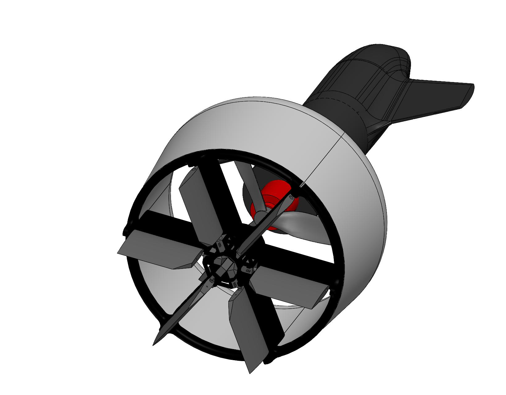
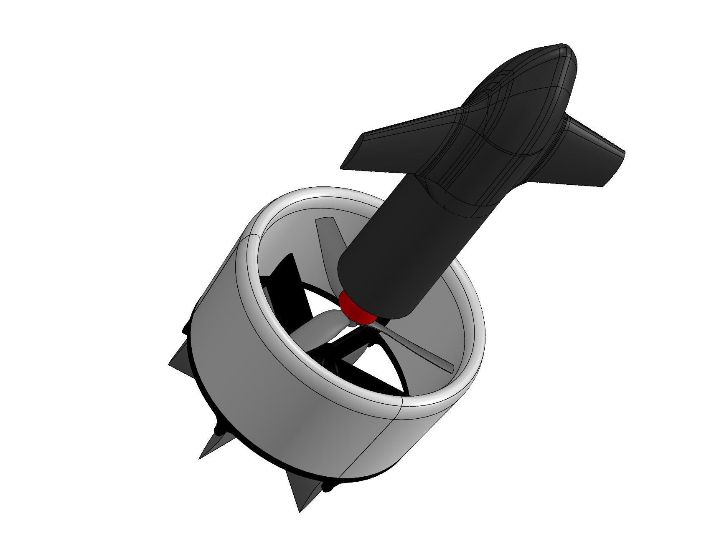
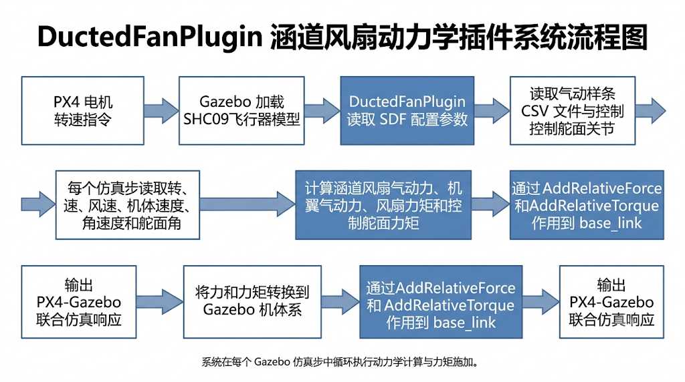
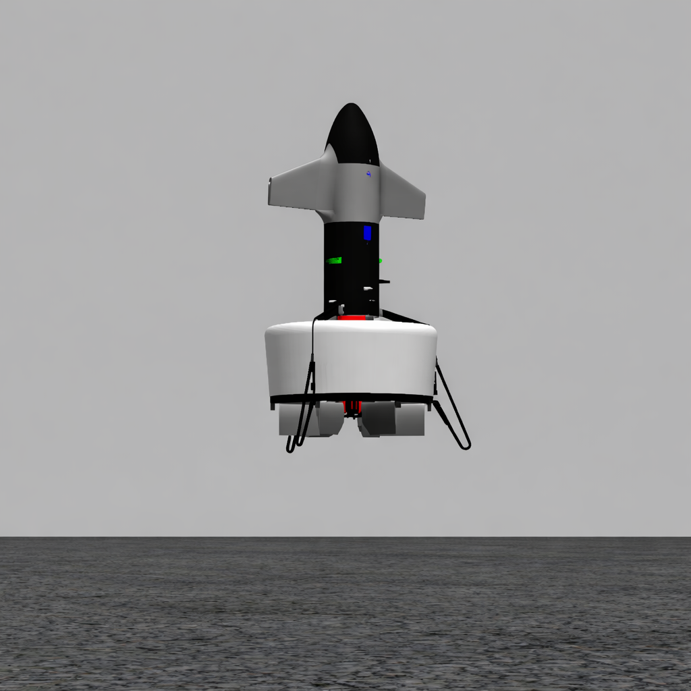
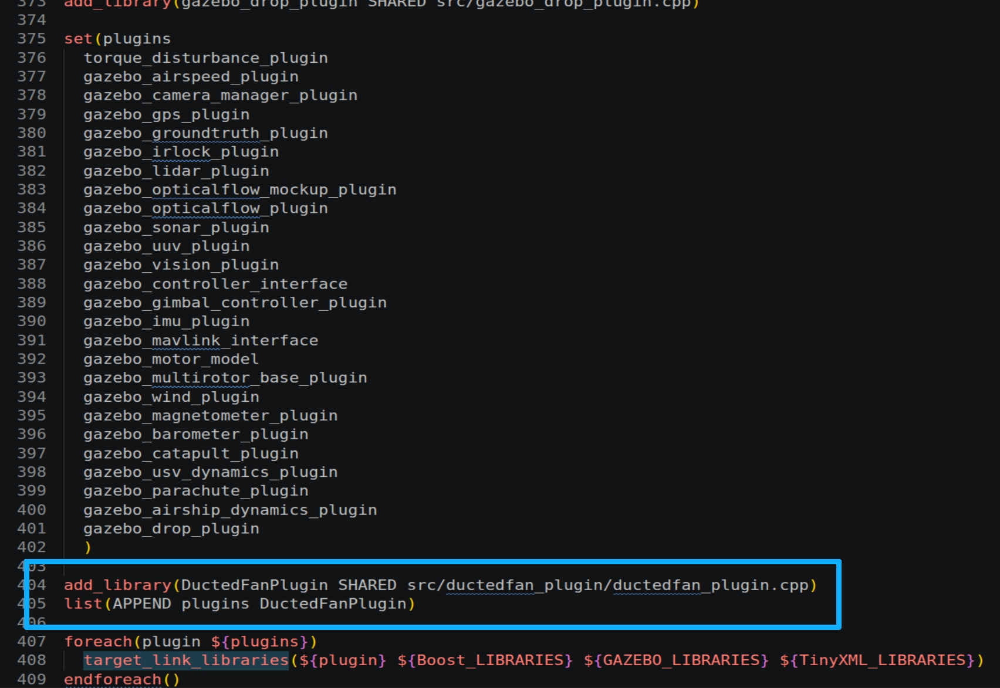
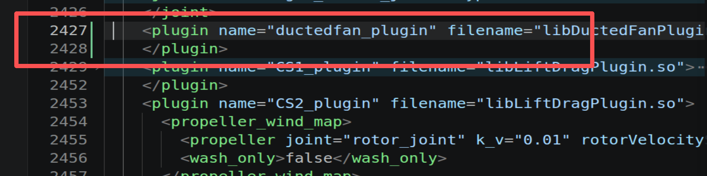
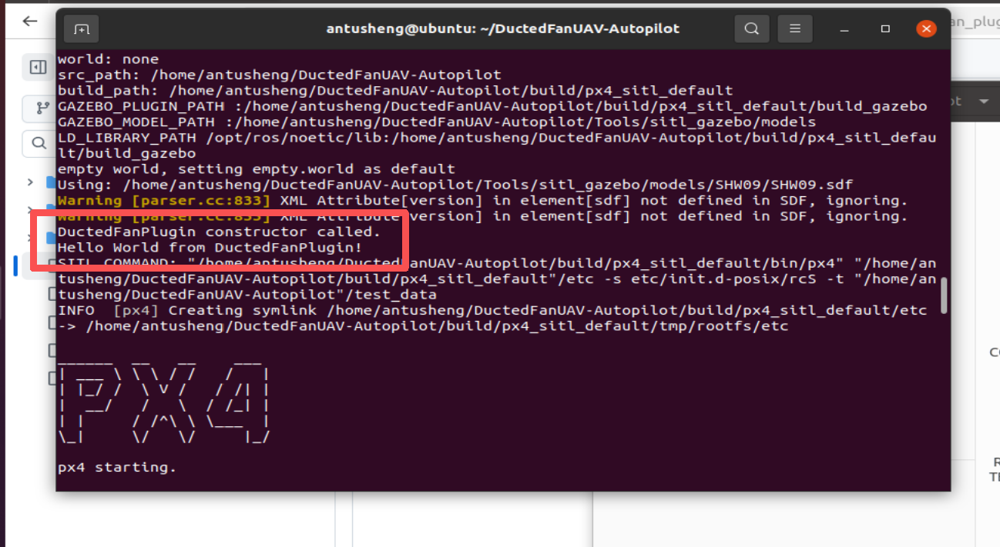
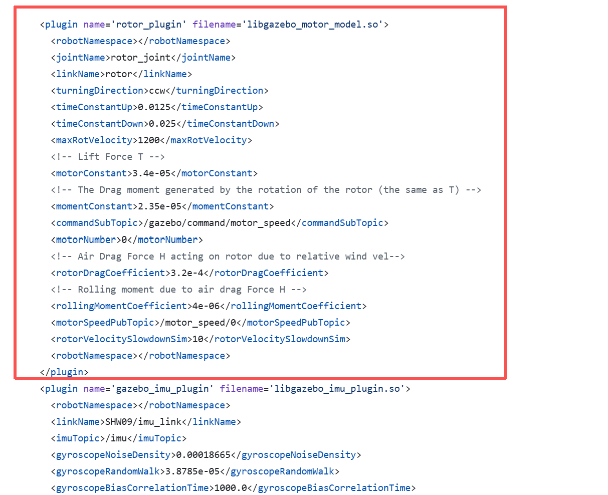
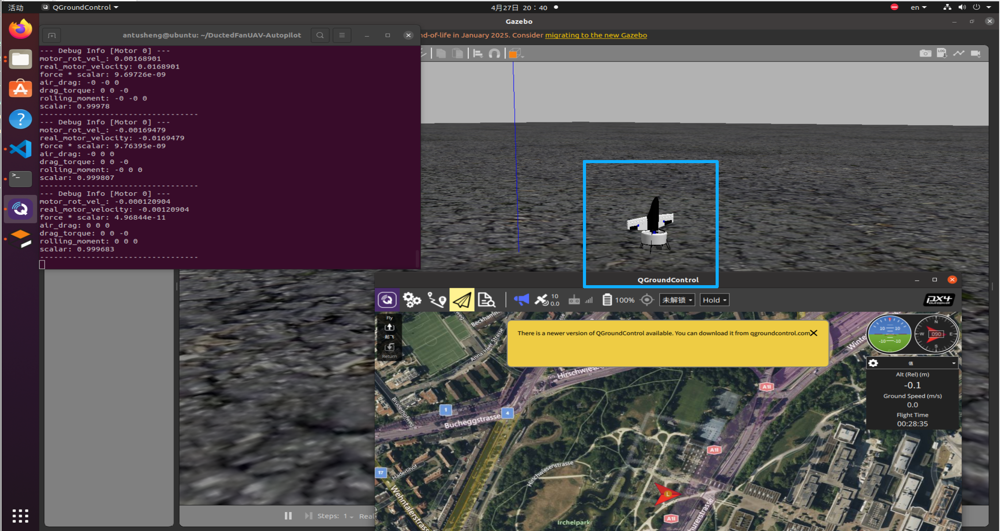
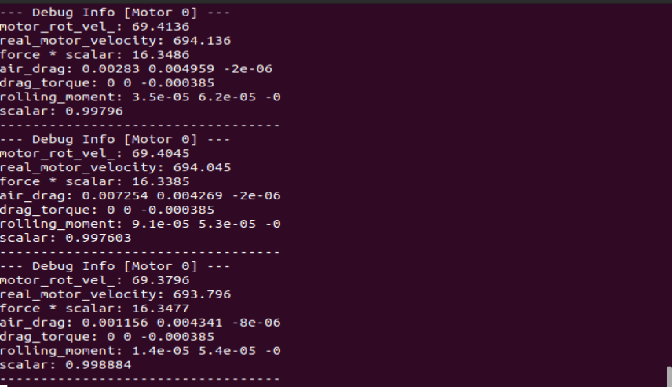

# DuctedFanPlugin V1.0 用户说明书

## 一. 软件功能概述

`DuctedFanPlugin` 是面向 PX4-Gazebo 联合仿真的涵道风扇动力学插件，主要服务于涵道风扇无人机模型。软件核心解决涵道飞行器在仿真环境中电机动力、涵道气动、机翼气动和控制舵面力矩分散建模的问题。系统通过集中式 Gazebo 模型插件，将原本分散在电机模型插件和多个气动插件中的动力学计算统一到同一流程中，使飞行器的合力、合力矩和模型响应具有更明确的作用对象与配置边界。

插件加载后，会读取模型 SDF 中的电机参数、涵道气动参数、控制舵面参数、控制效能矩阵以及样条系数文件路径。在每个 Gazebo 仿真步内，系统根据 PX4 下发的电机转速指令、机体速度、角速度、世界风速和舵面偏转角，计算涵道风扇推力、侧向力、机翼气动力、风扇反扭矩、涵道反扭矩、陀螺力矩和控制舵面力矩。计算结果转换到 Gazebo 机体系后，通过 `AddRelativeForce()` 与 `AddRelativeTorque()` 统一作用到 `base_link`。



图 1: SHC09 涵道式飞行器结构视图。图中可看到涵道、风扇、控制舵面和尾部机身等主要部件，插件动力学建模主要围绕这些部件的气动作用与力矩合成展开。



图 2: SHC09 涵道式飞行器后视结构。用户可通过该视角观察涵道内部风扇、尾部机体和控制舵面的空间布局，用于理解控制舵面力矩和涵道风扇推力的作用对象。

## 二. 开发目的

传统 PX4-Gazebo 模型中，电机推力、旋翼反扭矩、机翼气动作用和舵面气动作用通常由多个插件分别承担。该方式在复杂涵道飞行器建模时容易出现作用点分散、坐标转换不统一、舵面力矩重复施加以及模型参数难以集中校核等问题。

本软件的开发目的在于建立一个可运行、可扩展、便于调试的涵道风扇综合动力学插件，使用户能够在同一插件中集中配置和验证电机、涵道、机翼、风扇和控制舵面的关键动力学项，从而提高仿真模型的一致性和后续控制验证的可观测性。

## 三. 面向行业/领域

本软件主要面向无人机仿真、涵道风扇飞行器动力学建模、PX4 软件在环仿真、控制分配验证、定点悬停测试以及复杂气动模型调试等场景。适用对象包括无人机研发人员、飞行控制算法工程师、Gazebo 模型开发人员以及需要在仿真平台中验证涵道风扇飞行器响应特性的用户。

## 四. 软件技术特点

软件采用 Gazebo `ModelPlugin` 方式实现，随 SHC09 飞行器模型加载，并在每个仿真步参与动力学更新。系统能够接收 PX4 发布的电机转速指令，通过一阶滤波器模拟电机加速和减速响应，并结合 `rotorVelocitySlowdownSim` 将 Gazebo 中的可视化旋转速度还原为真实风扇转速。

在气动建模方面，系统支持读取涵道气动与机翼气动样条 CSV 文件，并通过 `PpvalSpline()` 完成分段三次样条插值。涵道推力、涵道侧向力、涵道俯仰力矩、风扇反扭矩、机翼气动力、非轴流阻尼、涵道反扭矩和风扇陀螺力矩均在统一流程中计算。对于控制舵面，系统可读取 1 到 6 号舵面关节角，并根据 SDF 中配置的控制效能矩阵计算控制舵面力矩 `M_cs`。

在调试与验证方面，系统支持读取世界风话题，用于相对风速、迎角和来流相关气动力计算；支持电机故障编号订阅，当故障编号与当前电机编号匹配时，可将对应电机转速强制置零；同时保留调试输出开关，用户可在需要时查看真实风扇转速、迎角、样条插值结果、推力、力矩和舵面角度等关键变量。

## 五. 系统流程图



图 3: DuctedFanPlugin 涵道风扇动力学插件系统流程图。系统由 PX4 电机转速指令触发，在 Gazebo 加载 SHC09 飞行器模型后读取 SDF 配置、气动样条文件和控制舵面关节，并在每个仿真步循环执行动力学计算、力矩合成和 `base_link` 施加过程，最终输出 PX4-Gazebo 联合仿真响应。

## 六. 软件界面与功能模块说明

本软件没有独立的桌面图形化操作界面，主要操作界面由 Gazebo 仿真窗口、PX4 / Gazebo 终端输出、SDF 配置文件和调试日志组成。用户通过模型配置、插件编译、仿真启动和终端检查完成主要使用流程。



图 4: Gazebo 悬停仿真环境。该界面用于观察涵道飞行器在固定点附近的姿态、位置和整体运动状态，是插件动力学效果的主要可视化入口。用户可通过该界面判断飞行器是否存在明显横向漂移、异常自旋或姿态发散。



图 5: CMake 插件编译位置说明。用户需要在 `Tools/sitl_gazebo/CMakeLists.txt` 中加入 `DuctedFanPlugin` 编译目标。编译完成后生成 `libDuctedFanPlugin.so`，SDF 文件中的插件名称必须与该库文件名保持一致。



图 6: 插件加载验证输出。用户完成 SDF 配置并重新编译后，可通过终端输出确认插件是否被 Gazebo 正常识别和加载。若终端提示找不到共享库，应优先检查 CMake 编译目标和 SDF 中的 `filename` 配置。



图 7: 最小闭环验证输出。该图用于确认插件从创建、编译、加载到终端打印的基础链路已经打通。用户在正式替换电机模型前，可先通过该类输出确认插件入口函数能够正常执行。



图 8: 插件替代验证画面。该画面用于观察自定义插件替代原电机模型后，飞行器是否仍能在 PX4-Gazebo 环境中正常运行。用户可结合模型姿态和终端输出判断力与力矩是否已经实际参与仿真。



图 9: 定高悬停验证画面。该图展示了替换插件后的涵道飞行器悬停状态，用于判断基础推力、姿态响应和动力学施加方向是否处于可继续验证的范围。



图 10: 命令行调试信息。该区域集中展示插件运行时的关键变量。用户可据此检查真实风扇转速、迎角、样条插值结果、推力、力矩和控制舵面力矩是否正常。

## 七. 软件运行与使用说明

软件建议运行在 Ubuntu 20.04、Gazebo Classic 和 PX4 SITL 环境中。用户应先安装涵道无人机自动驾驶仪工程，再将本插件文件接入该工程的 Gazebo 仿真目录。自动驾驶仪工程建议使用 `df-main` 分支，安装步骤如下：

```bash
git clone -b df-main --recursive https://github.com/tangqingxi/DuctedFanUAV-Autopilot.git
cd DuctedFanUAV-Autopilot
bash ./Tools/setup/ubuntu.sh
```

若用户已经下载过自动驾驶仪工程，可进入工程目录后切换到 `df-main` 分支，并更新子模块：

```bash
cd ~/DuctedFanUAV-Autopilot
git checkout df-main
git submodule update --init --recursive
```

自动驾驶仪工程安装完成后，将本项目中的插件源文件、头文件、模型文件和样条文件放入对应目录。其中，`ductedfan_plugin.cpp`、`spline_ppval.cpp` 应放入 `Tools/sitl_gazebo/src/ductedfan_plugin/`，`ductedfan_plugin.h`、`spline_ppval.h` 应放入 `Tools/sitl_gazebo/include/ductedfan_plugin/`，样条 CSV 文件和 SHC09 模型配置应放入 `Tools/sitl_gazebo/models/SHC09/`。

用户需要在 `Tools/sitl_gazebo/CMakeLists.txt` 中添加 `DuctedFanPlugin` 编译目标，确保编译后生成 `libDuctedFanPlugin.so`。随后在 SHC09 的 `.sdf.jinja` 文件中加入 `rotor_ductedfan_plugin` 插件块，并配置 `jointName`、`linkName`、`turningDirection`、`commandSubTopic`、`motorNumber`、电机参数、涵道参数、控制舵面参数和样条文件路径。修改 `.sdf.jinja` 后，建议删除旧的自动生成 `.sdf` 文件，再重新编译运行，避免旧配置继续生效。

本插件接入完成后，用户可在自动驾驶仪工程根目录启动 SHC09 仿真模型。启动命令如下：

```bash
cd ~/DuctedFanUAV-Autopilot
make px4_sitl gazebo_SHC09
```

启动后，用户应重点检查 `libDuctedFanPlugin.so` 是否成功加载、样条 CSV 是否成功读取、`base_link` 是否成功获取、`CS1_joint` 到 `CS6_joint` 是否成功读取，以及飞行器是否能够完成基础悬停或姿态响应。若需要观察内部变量，可在源码中打开 `DEBUG_PRINT`，重新编译后查看真实风扇转速、迎角、推力、力矩、控制舵面角度和 `M_cs` 等变量。

常见问题处理方式如下：插件无法加载时，应检查 SDF 中的 `filename="libDuctedFanPlugin.so"` 是否正确，并确认 CMake 已添加 `DuctedFanPlugin` 编译目标；样条文件读取失败时，应检查 CSV 是否位于 SHC09 模型目录下，并确认 SDF 路径是否使用 `model://SHC09/...` 格式；飞行器出现异常自旋时，应优先检查控制效能矩阵、舵面编号映射、舵面转角正方向、`M_cs` 符号和 `AddRelativeTorque()` 坐标方向；终端输出过多时，应确认 `DEBUG_PRINT` 是否已恢复为 `false`。

用户在修改模型参数时应注意，若本插件已经集中计算控制舵面力矩，应删除或禁用原先作用于六个控制舵面的分散式气动插件，避免力矩重复施加。`rotorVelocitySlowdownSim` 会影响仿真关节速度与真实风扇转速之间的映射关系，不宜随意更改。样条文件路径、文件名和模型名称需要保持一致，否则插件无法完成气动系数读取。
